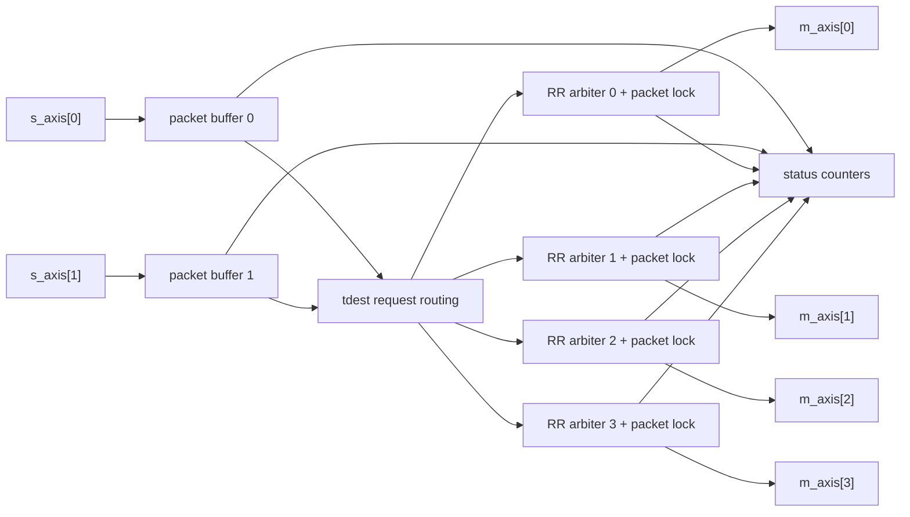

# AXI4-Stream Packet Router

A fixed 2-input, 4-output AXI4-Stream subset packet router written in
SystemVerilog. The design demonstrates destination-based packet routing,
store-and-forward buffering, packet-level arbitration, backpressure handling,
drop accounting, conventional randomized verification, a focused UVM
environment, lint, and reproducible generic Yosys synthesis reporting.

This project intentionally claims only the implemented AXI4-Stream subset. It
does not claim full AXI4-Stream compliance, formal proof, timing closure, ASIC
area, or FPGA implementation results.

## Architecture

- Two ingress stream interfaces and four egress stream interfaces.
- Supported stream signals: `tdata`, `tvalid`, `tready`, `tlast`, and `tdest`.
- First-beat `tdest` routes packets directly to output 0, 1, 2, or 3.
- One store-and-forward packet buffer per ingress.
- One independent round-robin arbiter per output.
- Output ownership locks for a full packet and releases on the accepted
  `tlast` beat.
- Invalid-destination, oversize, and malformed changing-`tdest` packets are
  consumed, dropped, and counted once.
- Synchronous active-high reset clears buffers, locks, arbiters, and counters.

The accepted tradeoff is head-of-line blocking: each ingress has one packet
buffer, so a complete packet waiting for a stalled or contended output prevents
that ingress from accepting a later packet for another output.

Architecture diagram source: `docs/architecture.mmd`.



## Verification

The executable verification baseline includes:

- Directed and parameterized Icarus Verilog testbenches.
- Reusable conventional AXI-Stream subset interface, source/sink BFMs,
  monitors, independent packet-level reference model, scoreboard, timeouts, and
  procedural protocol checks.
- Deterministic randomized conventional regressions with required scenario
  coverage bins.
- Focused Verilator + UVM environment with ingress/egress agents, virtual
  sequences, reference model, scoreboard, and coverage summaries.
- Forced-failure targets for both conventional and UVM scoreboards.
- Verilator RTL lint and Yosys parse/elaboration/check.

Measured scenario coverage is explicit bin counting, not formal or functional
coverage closure. Current bins include both ingresses, all destinations,
ingress by destination, single/multi/max-capacity packets, contention winners,
round-robin transitions, stalls, lock-held stalls, all drop reasons, valid
traffic after drops, reset scenarios, counter wrap, and head-of-line blocking.

## Synthesis Reporting

`make synth-report` runs a generic technology-independent Yosys flow and writes:

- Detailed generated logs under `build/`.
- A concise tracked summary in `docs/synthesis-summary.md`.

The report is useful for reproducibility and structural inspection. It is not
an ASIC area, FPGA timing, power, or implementation-quality result.

## Commands

```sh
make sim              # focused directed regression
make test             # directed, parameter tests, lint, synth-check
make random           # conventional random seeds 1 7 23 101
make random-seed SEED=<n>
make regression       # make test plus make random
make closure          # make test plus 16 conventional random seeds and synth report
make uvm-smoke
make uvm-test TEST=<test-name> SEED=<n>
make uvm-random SEED=<n>
make uvm-regression   # focused UVM tests plus seeds 1 7 23 101
make uvm-closure      # focused UVM tests plus 16 UVM random seeds
make full-regression  # conventional closure, UVM closure, failure checks
make failure-check
make uvm-failure-check
make lint
make synth-check
make synth-report
make clean
make distclean
```

Generated files are written under `build/`. The pinned UVM dependency is fetched
under `build/deps/uvm` by `scripts/setup-uvm.sh`.

## Repository Structure

- `rtl/` - synthesizable SystemVerilog RTL.
- `tb/` - directed, random, and UVM testbench sources.
- `filelists/` - explicit RTL and testbench filelists.
- `docs/` - architecture, verification, decisions, results, and synthesis
  summaries.
- `project/` - milestone status and history.
- `scripts/` - repository, UVM, and synthesis workflow helpers.
- `reports/` - historical checked-in inherited artifacts.
- `build/` - generated outputs; ignored by Git.

## Known Limitations

- No AXI4 memory-mapped or AXI4-Lite interface.
- No `tkeep`, `tstrb`, `tid`, or `tuser`.
- No partial final-beat representation.
- Fixed 2-input, 4-output structure.
- No virtual output queues and no cut-through forwarding.
- No configurable route table.
- No formal proof or coverage-closure claim.
- No reproducible Vivado, FPGA implementation, timing, or power flow.

Future extensions could add `tkeep`, virtual output queues, cut-through
forwarding, arbitrary port counts, formal verification, commercial simulator
validation, or a reproducible FPGA implementation flow.
