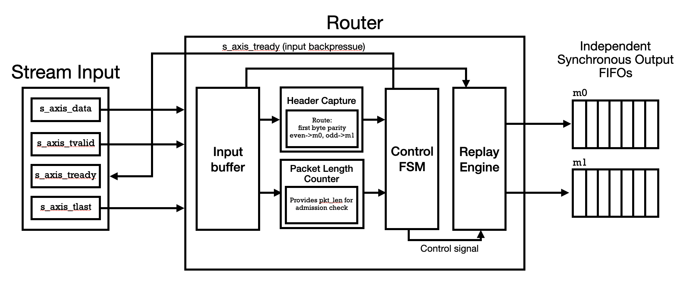
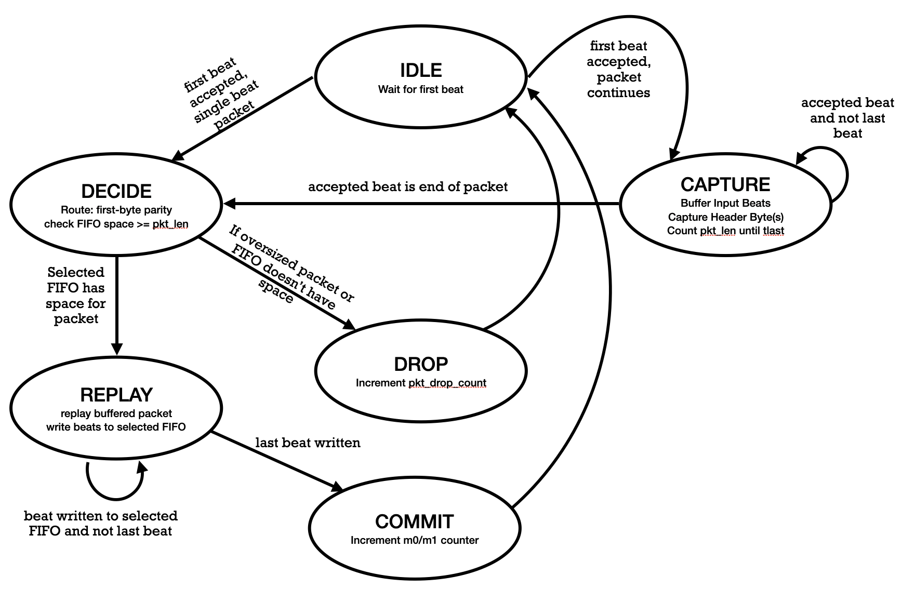
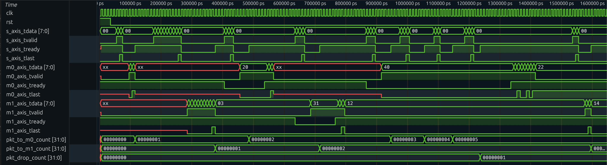
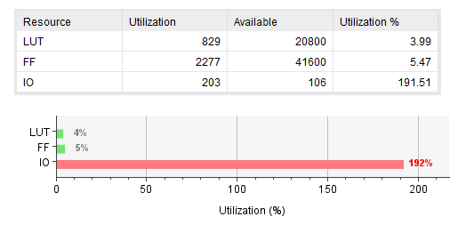
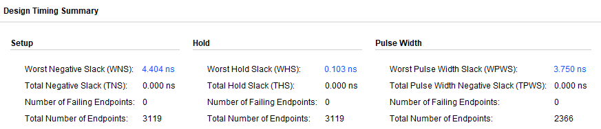

# Task 2 — AXI4-Stream Packet Router

**Candidate:** Advait Paranjpe  
**Task:** AXI4-Stream packet router with two outputs, packet-level routing, buffering, drop behavior, and verification

---

## 1. Overview

This task implements an **AXI4-Stream packet router** with:

- **1 AXI4-Stream slave input** (`s_axis_*`)
- **2 AXI4-Stream master outputs** (`m0_axis_*`, `m1_axis_*`)
- **Packet-level routing** based on the **parity of the first byte** of each packet:
  - **Even** first byte → route to **m0**
  - **Odd** first byte → route to **m1**
- **Store-and-forward buffering** (entire packet captured before forwarding)
- **Per-output FIFO buffering**
- **Drop behavior** when the selected output FIFO does not have space for the full packet
- **Packet counters** for routed and dropped packets

The design supports **independent output backpressure** (`m0_axis_tready`, `m1_axis_tready`) and was verified with a directed testbench including packet scoreboarding and coverage flags.

---

## 2. Architecture Summary

### 2.1 High-level architecture

The design uses a **store-and-forward** architecture:

1. **Capture** the full incoming packet into an internal packet capture buffer.
2. **Extract/track header information** (first byte used for route parity decision).
3. **Count packet length** (in beats) during capture.
4. **Decide route** (m0/m1) and perform **admission check**:
   - If selected output FIFO has enough free space for the **entire packet**, forward it.
   - Otherwise, **drop** the packet.
5. **Replay** buffered packet beats into the selected output FIFO.
6. **Commit counters** (`pkt_to_m0_count`, `pkt_to_m1_count`, `pkt_drop_count`).

This matches the task requirements while keeping control logic simple and deterministic.

### 2.2 Why store-and-forward was chosen

A store-and-forward approach was chosen because it naturally supports the required behavior:

- Packet-level routing decision
- Whole-packet admission check into selected output FIFO
- Clean drop policy (drop full packet if insufficient space)
- Simple verification and clear FSM behavior

While cut-through / virtual cut-through could increase throughput in more advanced designs, in this task the store-and-forward architecture provides a straightforward and robust implementation.

### 2.3 Architectural Block Diagram


Block-level architecture of the AXI4-Stream packet router. The router captures one input packet into an ingress buffer, extracts routing information from the first byte (even parity → m0, odd parity → m1), computes packet length for admission checking, and uses a control FSM to either replay the buffered packet into the selected output FIFO or drop it if the packet is oversized or the destination FIFO lacks space. s_axis_tready provides input backpressure to the upstream source.

---

## 3. Key RTL Blocks

### 3.1 Ingress packet capture buffer
- Stores incoming packet data (`cap_data`) and end-of-packet markers (`cap_last`)
- Captures one packet at a time (v1 design)
- Supports bounded packet size via `MAX_PKT_BEATS`

### 3.2 Header capture / route metadata
- Tracks first bytes of packet (`header_q`, first 8 bytes collected)
- Uses first byte parity for route selection:
  - `header_q[0] == 0` → m0
  - `header_q[0] == 1` → m1

### 3.3 Packet length tracking
- Counts number of beats in the captured packet (`pkt_len_beats_q`)
- Used for selected output FIFO admission check

### 3.4 Per-output synchronous AXI FIFOs
- `u_fifo_m0` and `u_fifo_m1`
- Decouple router replay logic from downstream backpressure
- Expose occupancy (`count_o`) used for admission check

### 3.5 Control FSM
The router is controlled by a finite-state machine (FSM) that sequences:
- packet capture
- route/admission decision
- replay into output FIFO
- counter commits (sent/drop)

---

## 4. FSM Behavior (Control Flow)

The control FSM uses the following states (simplified view):

- **IDLE** — wait for first input beat
- **CAPTURE** — capture packet beats until end-of-packet
- **DECIDE** — determine route and check selected FIFO has whole-packet space
- **REPLAY** — replay buffered packet into selected output FIFO
- **SENT_COMMIT** — increment routed packet counter
- **DROP_COMMIT** — increment drop counter


Control FSM for the AXI4-Stream packet router. The router buffers each incoming packet, determines the destination from the first-byte parity (even → m0, odd → m1), checks packet-length/FIFO-space eligibility, and then either replays the packet into the selected output FIFO (commit) or drops it. s_axis_tready applies backpressure during capture/admission.

### 4.1 State transition summary
- `IDLE -> CAPTURE` when first accepted beat is **not** end-of-packet
- `IDLE -> DECIDE` when first accepted beat is a **single-beat packet**
- `CAPTURE -> DECIDE` when end-of-packet beat is accepted
- `DECIDE -> REPLAY` if packet is valid and selected FIFO has enough space
- `DECIDE -> DROP_COMMIT` if packet is oversized or selected FIFO lacks space
- `REPLAY -> SENT_COMMIT` after last buffered beat is accepted by selected FIFO
- `SENT_COMMIT -> IDLE`
- `DROP_COMMIT -> IDLE`

---

## 5. AXI4-Stream Handshake / Backpressure Behavior

### 5.1 Input side (`s_axis_*`)
- `s_axis_tready` is driven by the router and is asserted only while the FSM is able to accept/capture input beats (IDLE/CAPTURE in this design).
- Input data transfer occurs only when:
  - `s_axis_tvalid == 1`
  - `s_axis_tready == 1`

### 5.2 Output side (`m0_axis_*`, `m1_axis_*`)
- Each output has an independent AXI FIFO and independent `tready`.
- Backpressure on one output does **not** block forwarding to the other output (subject to packet routing and FIFO space).
- This satisfies the requirement that backpressure be supported **independently per output**.

---

## 6. Verification Strategy

Verification was performed using a **directed SystemVerilog testbench** with:

- AXI-stream source driver task (`send_packet`)
- Output packet monitors for `m0` and `m1`
- Scoreboard (expected vs actual packet data/length)
- Counter checks for routed/dropped packets
- Coverage flags for key behaviors
- VCD waveform dumping for debug/inspection (Surfer / GTKWave)

Simulation was run using **Icarus Verilog** (`iverilog` + `vvp`).

---

## 7. Directed Test Cases

The testbench includes the following directed scenarios:

### Test 1 — Route to m0 (short packet)
- Packet with even first byte
- Verifies route to `m0`
- Also covers short-packet behavior

### Test 2 — Route to m1 (long packet)
- Packet with odd first byte
- Verifies route to `m1`
- Packet length > 8 bytes (exercises header capture span and longer replay)

### Test 3 — m0 backpressure
- `m0_axis_tready` held low temporarily
- Packet routed to `m0`
- Verifies packet is buffered and drained later when ready is reasserted

### Test 4 — m1 backpressure
- `m1_axis_tready` held low temporarily
- Packet routed to `m1`
- Verifies independent backpressure behavior on second output

### Test 5 — Drop due to insufficient selected FIFO space
- `m0_axis_tready` held low to build FIFO occupancy
- Multiple packets enqueued to fill `m0` FIFO near capacity
- Additional packet routed to `m0` that does not fit → expected **drop**
- Verifies `pkt_drop_count` increment and no incorrect output packet emission

### Test 6 — Post-drop recovery
- Packet routed to `m1` after drop scenario
- Verifies router continues operating correctly after drop event

---

## 8. Scoreboard and Data Integrity Checks

The testbench monitors packet outputs on `m0` and `m1` and reconstructs packets beat-by-beat using `tlast`.

It then checks:

- **Packet counts per destination**
- **Packet lengths**
- **Byte-for-byte payload equality**
- **Final DUT counters**
  - `pkt_to_m0_count`
  - `pkt_to_m1_count`
  - `pkt_drop_count`

Any mismatch causes simulation failure (`$fatal`).

---

## 9. Coverage

The task requested showing that key conditions were reached (routing to both outputs, drop events, backpressure cases). This was implemented using simple testbench flags/counters, which is acceptable per the brief.

### 9.1 Coverage conditions tracked
- Routing to **m0**
- Routing to **m1**
- **Drop** event observed
- **Backpressure on m0** observed (`m0_axis_tvalid && !m0_axis_tready`)
- **Backpressure on m1** observed (`m1_axis_tvalid && !m1_axis_tready`)
- **Short packet** seen
- **Long packet** seen

### 9.2 Coverage checks
At end of simulation, the testbench checks all coverage flags and fails if any expected condition was not hit.

### Waveform Output

Representative simulation waveform validating functional correctness of the AXI4-Stream packet router. The observed handshakes, output packet streams, tlast alignment, and packet counters match the expected outcomes of the directed test cases (routing, backpressure, drop, and recovery), providing evidence that the RTL is robust under the tested operating conditions.

---

## 10. Synthesis Reports and Result Interpretation (Vivado)

To provide implementation-oriented evidence beyond simulation, the RTL was synthesized in **Xilinx Vivado** (Artix-7 target) and the following **post-synthesis reports** were generated:

- **Timing Summary** (`timing_summary_synth.rpt`)
- **Utilization Report** (`utilization_synth.rpt`)

> **Note:** The results below are **post-synthesis** (not post-implementation), because implementation/bitstream generation failed due top-level I/O pin overutilization on the selected FPGA package.

### 10.1 Timing Summary (post-synthesis)
From the Vivado **Design Timing Summary** screenshot/report:

- **Worst Negative Slack (WNS):** **4.404 ns**
- **Total Negative Slack (TNS):** **0.000 ns**
- **Number of Failing Endpoints:** **0**
- **Worst Hold Slack (WHS):** **0.103 ns**
- **Total Hold Slack (THS):** **0.000 ns**
- **Worst Pulse Width Slack (WPWS):** **3.750 ns**




Vivado also reports:

- **“All user specified timing constraints are met.”**

#### Interpretation
The clock constraint used was:

```tcl
create_clock -name clk -period 10.000 [get_ports clk]
```

This corresponds to a **100 MHz target clock**.  
A **positive WNS of 4.404 ns** means the synthesized design meets the 100 MHz constraint with margin in post-synthesis timing analysis.

---

### 10.2 Resource Utilization (post-synthesis)
From the Vivado utilization summary screenshot/report:

- **LUTs:** **829 / 20800** (**3.99%**)
- **FFs:** **2277 / 41600** (**5.47%**)
- **I/O:** **203 / 106** (**191.51%**)

#### Interpretation
- **Logic utilization is low** (LUT/FF usage is modest), indicating the router and associated FIFOs are not resource-heavy for the selected Artix-7 device.
- **I/O utilization exceeds device/package capacity** because the AXI4-Stream router top-level exposes a large number of ports (AXI buses, handshakes, and status outputs), which Vivado maps to physical FPGA pins when targeting a real device.

This is why implementation fails with an I/O placement error, even though synthesis succeeds.

---

## 11. Design Limitations / Future Improvements

### Current limitations (v1)
- Processes one packet at a time through capture → decide → replay flow
- Store-and-forward introduces latency (full packet must be captured before replay)
- Packet size bounded by `MAX_PKT_BEATS`

### Potential improvements
- Virtual cut-through / cut-through forwarding (if task requirements allowed)
- Multi-packet ingress buffering
- More advanced route logic (beyond first-byte parity)
- Formal property verification (e.g., SymbiYosys)
- Randomized constrained-random testbench in addition to directed tests

---

## 12. Conclusion

The implemented AXI4-Stream packet router meets the core Task 2 requirements:

- Packet-level routing to two outputs
- Per-output FIFO buffering
- Whole-packet admission check and drop behavior
- Independent output backpressure handling
- Verification using directed tests, scoreboard checks, and coverage flags

The final design is intentionally simple and robust, using a store-and-forward architecture that is easy to reason about, debug, and verify.

---
